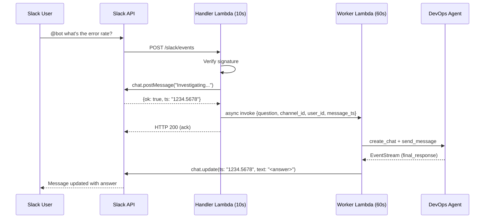
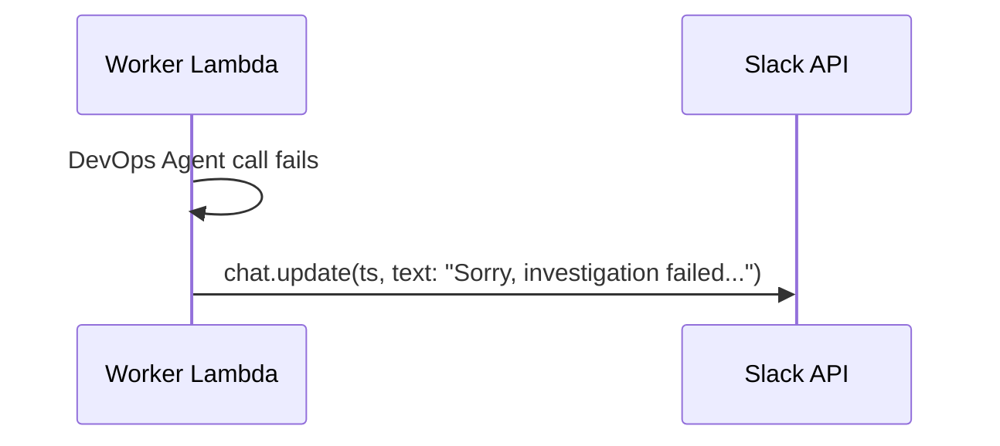

# Design: Slack Placeholder Message

## Approach

The Handler Lambda posts an "Investigating..." message immediately (using the existing `bot_token` and `chat.postMessage`), captures the returned message `ts`, and passes it alongside the question payload when async-invoking the Worker Lambda. The Worker uses `chat.update` (same API, same token, same channel + ts) to replace the placeholder with the final answer or an error message. This requires no new infrastructure — only code changes to two existing Lambda handlers.

## Architecture

- Components modified: `slack/lambda/slack-handler/handler.py`, `slack/lambda/slack-worker/handler.py`
- No new components, secrets, or IAM permissions required.
- Slack API methods used: `chat.postMessage` (Handler), `chat.update` (Worker)

## Sequence



**Failure path:**


## Data

No schema changes. The Worker Lambda payload gains one new field:

```json
{
  "question": "...",
  "channel_id": "C123",
  "user_id": "U456",
  "message_ts": "1717680000.123456"
}
```

`message_ts` is a Slack message timestamp string (acts as a unique message ID within a channel).

## Error handling

| Failure | Behavior |
|---------|----------|
| `chat.postMessage` fails in Handler | Log warning, still dispatch worker without `message_ts`; Worker falls back to `chat.postMessage` (current behavior) |
| Worker fails after placeholder posted | `chat.update` replaces placeholder with error message |
| Worker times out (Lambda 60s limit) | Placeholder remains as "Investigating..." — mitigated by keeping Worker timeout well above the ~18s agent p99 |
| `chat.update` fails in Worker | Fall back to `chat.postMessage` as a new message |

## Testing

- **Unit (Handler):** Mock `_http.request` for `chat.postMessage`, verify it's called before `dispatch_worker`, verify `message_ts` is passed in the worker payload.
- **Unit (Worker):** Mock `_http.request`, verify `chat.update` is called with the correct `ts` when `message_ts` is present; verify `chat.postMessage` fallback when `message_ts` is absent.
- **Integration (live):** Send an `app_mention` event, observe placeholder appears within 3s, then gets replaced with the agent answer.

## Risks

| Risk | Mitigation |
|------|------------|
| `chat.postMessage` adds latency to the Handler (must stay <3s) | Slack API responds in ~200ms; Handler still well within budget |
| Race condition: Worker finishes before placeholder is visible | Not possible — Worker is invoked after placeholder is posted |
| Placeholder left stale if Worker crashes without updating | Lambda async invoke has built-in retries (2 attempts); worst case the user sees "Investigating..." for ~5 min until they notice |
