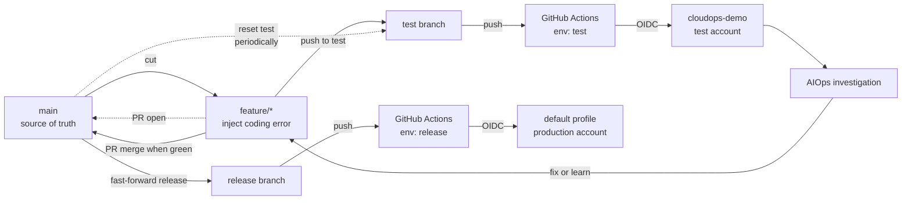

# CI/CD

`main` is the source of truth. `test` and `release` are **deployment pointers** — branches whose only job is to trigger a deploy when something is pushed to them. Pushes to these branches trigger GitHub Actions, which assumes an AWS role via OIDC and runs `cdk deploy`.

## Branch roles

| Branch      | Purpose                                           | Protected | Deploys to                      |
|-------------|---------------------------------------------------|-----------|---------------------------------|
| `main`      | Source of truth. All feature branches cut from here. PRs only. | yes       | nothing                         |
| `feature/*` | Short-lived. Cut from `main`. PRs target `main`.  | no        | nothing                         |
| `test`      | Deployment pointer for the test account.          | yes (push-only by you) | cloudops-demo (test account) |
| `release`   | Deployment pointer for the production account.    | yes       | default profile (prod account)  |

## Pipeline



Key idea: `test` and `release` never receive "real" merges. They are fast-forwarded to commits from `main` (or a `feature/*` branch, for `test`). The only branch that accumulates history is `main`.

## Mapping

| Branch    | GitHub environment | AWS account       | Local profile    | Role name                       |
|-----------|--------------------|-------------------|------------------|---------------------------------|
| `test`    | `test`             | test account      | `cloudops-demo`  | `gha-serverless-demo-test`      |
| `release` | `release`          | production account| `default`        | `gha-serverless-demo-release`   |

The workflow reads `vars.AWS_DEPLOY_ROLE_ARN` from the matching GitHub environment, so the same workflow YAML works for both.

## Workflow

[`.github/workflows/deploy.yml`](.github/workflows/deploy.yml) triggers on push to `test` or `release`, plus `workflow_dispatch` where you pick the target. Each run:

1. **resolve** — picks the target environment (`test` or `release`) from the branch name or the dispatch input.
2. **stack_health** — assumes the OIDC role, queries CloudFormation for any `aiops-cat-demo-*` stack in a failed/rollback state (`CREATE_FAILED`, `ROLLBACK_*`, `UPDATE_FAILED`, `UPDATE_ROLLBACK_*`, `IMPORT_ROLLBACK_*`). If anything is unhealthy, sets `needs_recovery=true`.
3. **changes** — runs `dorny/paths-filter` against the previous push to decide which phases need to run. Folds `needs_recovery` into `force_all` so a rollback state forces every phase to redeploy regardless of code diff.
4. **deploy** — assumes the role, runs `cdk bootstrap` if needed, then executes the three phases below.

The deploy job runs on `ubuntu-24.04-arm` because agent and chatbot Docker images target `linux/arm64` (Fargate ARM64 + AgentCore). Building natively on ARM avoids QEMU emulation failures during `npm ci` with native modules.

### Deploy phases

| Phase | What                                                                                  | When it runs                                         |
|------:|---------------------------------------------------------------------------------------|------------------------------------------------------|
| 1     | `cdk deploy ecr observability data api gateway -c imageTag=<sha>`                     | first run, force, or change to `cdk` / `lambda` / `chatbot` |
| 2a    | ECR login + `docker buildx build --platform linux/arm64 --push` for langgraph / strands / chatbot (whichever changed) | corresponding agent or chatbot folder changed |
| 2b    | Retag `:latest` → `:<sha>` for any image that did *not* rebuild                       | partial rebuild path so all stacks share one tag     |
| 3     | `cdk deploy agents fargate ui -c imageTag=<sha>`                                      | first run, force, or change to `cdk` / `langgraph` / `strands` / `chatbot` |

Phase 1 is *not* run with `-c skipAgents=true`. The flag tells `app.ts` to skip constructing `AgentStack` at synth time, which makes the ECR exports look unused and CDK tries to delete them — and the live `AgentStack` in AWS still consumes those exports, so the deploy aborts and rolls back. Instead, every stack is constructed at synth time and `cdk deploy` only deploys the names it's given.

### Stack-health auto-recovery

Without the `stack_health` job, the change-detection step would skip Phase 1 entirely on commits that didn't touch watched paths — even when the live stack was sitting in `UPDATE_ROLLBACK_COMPLETE` from a prior failure. Result: no recovery, the broken state persisted, and the workflow showed green. The pre-flight check forces a full redeploy whenever any project stack is unhealthy, so a follow-up commit (or a manual `workflow_dispatch` re-run) reliably recovers a broken environment.

## One-time setup (per account)

Run the setup script once with each AWS profile:

```bash
# Test account — cloudops-demo profile → 'test' environment
AWS_PROFILE=cloudops-demo GH_ENV=test ./scripts/ci/setup-github-oidc.sh

# Production account — default profile → 'release' environment
AWS_PROFILE=default GH_ENV=release ./scripts/ci/setup-github-oidc.sh
```

Each run creates the GitHub OIDC provider in that account (if missing), the deploy role scoped to that GitHub environment, attaches `AdministratorAccess` (test-only project), and — if `gh` is authed — creates the environment and sets the `AWS_DEPLOY_ROLE_ARN` variable automatically.

### Enable CloudWatch Transaction Search (per account, one-time)

AgentCore Gateway delivers spans via CloudWatch Logs delivery (the
`gateway-stack` wires `DeliverySource` → `DeliveryDestination` of type
`XRAY`). For those spans to appear in the GenAI Observability dashboard,
the account must have Transaction Search enabled. Propagation takes ~10
minutes, which is why this lives outside CDK.

```bash
# Run once per account, in us-east-1.
AWS_PROFILE=cloudops-demo aws xray update-trace-segment-destination \
  --destination CloudWatchLogs --region us-east-1
AWS_PROFILE=default        aws xray update-trace-segment-destination \
  --destination CloudWatchLogs --region us-east-1
```

Verify in the CloudWatch console under **Application Signals (APM) →
Transaction search** that ingestion is enabled before expecting traces
on the dashboard.

## Typical loop (AIOps investigation)

```bash
# 1. Cut a feature branch from main
git checkout main && git pull
git checkout -b feature/bug-xyz
# ... edit lambda code, inject the bug directly in source ...
git commit -am "inject: null deref in getItem handler"
git push -u origin feature/bug-xyz

# 2. Deploy this feature branch to the test account.
#    Force-push the feature commit onto 'test' — do NOT merge.
#    'test' is a disposable pointer, it's fine to overwrite.
git push --force-with-lease origin feature/bug-xyz:test
# → GitHub Actions deploys to cloudops-demo

# 3. Run the AIOps investigation against the test account.
#    Iterate on the feature branch as needed; repeat step 2 to redeploy.

# 4. When the feature is good, open a PR: feature/bug-xyz → main
#    Review, then squash-merge on GitHub.

# 5. Promote main to production by fast-forwarding 'release' to main.
git checkout release && git pull
git merge --ff-only main
git push origin release
# → GitHub Actions deploys to production
```

## Why force-push to `test` instead of merging?

- `test` is an **ephemeral pointer**, not a long-lived branch with history worth preserving.
- Merging `feature/x` into `test`, then `feature/y`, then `feature/z` leaves a tangled history on `test` that nobody reads and that drifts away from `main`. Eventually `test` and `main` share no meaningful commits.
- Force-pushing to `test` means "deploy exactly this commit to the test account" — clear, atomic, no merge commits.
- Only you (or CI) pushes to `test`, so there is no collaborator to surprise. `--force-with-lease` protects against races.

## Resetting `test` back to `main`

Periodically (or whenever investigation is done), snap `test` back onto `main` so it doesn't diverge:

```bash
git checkout main && git pull
git push --force-with-lease origin main:test
# → redeploys a clean main to the test account
```

## Rules for `main`

- Every change arrives through a PR. No direct pushes.
- Required checks before merge: `cdk synth` (ideally run on PRs as a separate workflow — not yet wired up here).
- Prefer squash-merge so each feature becomes one commit on `main`.
- `main` itself never triggers a deploy — the only way to ship is to update `test` or `release`.

## Rules for `release`

- Only advance `release` via fast-forward from `main`:
  ```bash
  git checkout release && git pull && git merge --ff-only main && git push
  ```
- If `--ff-only` fails, `release` has diverged (hotfix landed directly, someone force-pushed, etc). Investigate before resolving — do not create a merge commit.
- Tag the commit on `main` before advancing `release` if you want a release marker:
  ```bash
  git checkout main && git tag -a v0.3.0 -m "release 0.3.0" && git push --tags
  git checkout release && git merge --ff-only main && git push
  ```

## Hotfix path

If production is on fire and you can't wait for the normal loop:

1. Cut `hotfix/xyz` from `release` (the commit currently in prod), not `main`.
2. Force-push `hotfix/xyz:test` to verify the fix in the test account.
3. When the fix works, merge `hotfix/xyz` into `main` via PR (so `main` stays the source of truth).
4. Fast-forward `release` to the resulting commit on `main` and push.

This keeps `main` authoritative even under pressure.

## Teardown

```bash
AWS_PROFILE=cloudops-demo GH_ENV=test ./scripts/ci/teardown-github-oidc.sh
AWS_PROFILE=default GH_ENV=release ./scripts/ci/teardown-github-oidc.sh
```

Removes the deploy role and the GitHub environment variable. CDK stacks are left alone — run `cdk destroy --all` with the matching profile if you want those gone too.

## Notes for this test project

- `AdministratorAccess` is used for simplicity. Tighten before using on anything real.
- The trust policy pins to the GitHub **environment** (not the branch ref), so `workflow_dispatch` works too as long as the run targets that environment.
- Branch protection is not set by the scripts. Recommended rules:
  - `main`: require PR, require 1 review, disallow force-push, disallow deletion.
  - `release`: disallow force-push, allow only fast-forward pushes (effectively, only advance via `main`).
  - `test`: allow force-push (it's the deploy pointer), restrict who can push to you / CI.
