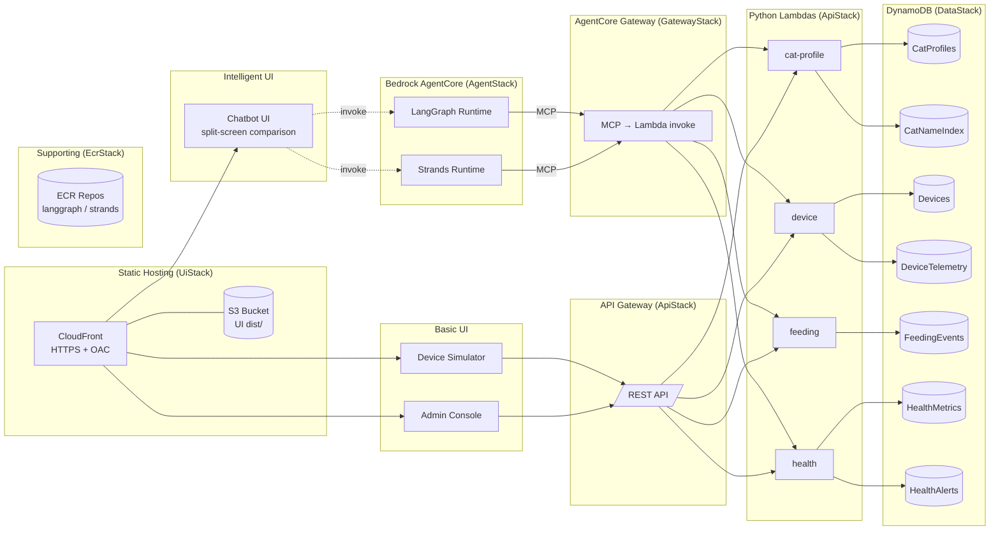

# Architecture

A serverless cat-care IoT demo built as a single CDK (TypeScript) app.
Every component is fully managed: API Gateway + Lambda, DynamoDB,
Bedrock AgentCore Runtime, and CloudFront + S3. No VPC, no EKS, no ECS,
no Cognito. All stacks deploy to `us-east-1`.

The whole point of the repo is to be *deliberately breakable* — bugs get
committed into Lambda or agent source on a `feature/*` branch, deployed
to the test account, and investigated with AIOps tooling. The design
below is optimized for clean failure surfaces, not production rigor.

## High-level diagram



## Stacks

The app is broken into eight CloudFormation stacks under `cdk/lib/`,
wired from `cdk/bin/app.ts`:

| Stack                | File                       | Purpose                                                       |
|----------------------|----------------------------|---------------------------------------------------------------|
| `DataStack`          | `data-stack.ts`            | All DynamoDB tables. No dependencies.                         |
| `ApiStack`           | `api-stack.ts`             | API Gateway + four Python Lambdas. Depends on DataStack.      |
| `EcrStack`           | `ecr-stack.ts`             | Named ECR repos (one per agent image, plus chatbot). No deps. |
| `AgentStack`         | `agent-stack.ts`           | AgentCore runtimes referencing tagged images in EcrStack repos. |
| `GatewayStack`       | `gateway-stack.ts`         | AgentCore Gateway (MCP) + 4 GatewayTargets pointing to Lambdas. |
| `FargateStack`       | `fargate-stack.ts`         | ECS Fargate + ALB hosting the Next.js chatbot BFF.            |
| `ObservabilityStack` | `observability-stack.ts`   | Account/region-scoped Application Signals discovery (one-shot). |
| `UiStack`            | `ui-stack.ts`              | CloudFront + S3 hosting the static UIs (device-sim, admin).   |

Deployment order: `EcrStack` must exist before images are pushed, and
images must be pushed before `AgentStack` is deployed. CI handles this
as three phases (see **Deployment pipeline** below). DataStack and
UiStack are independent and can deploy alongside either phase.

## Data layer

Six DynamoDB tables, one per bounded context, all pay-per-request.
Single-table-per-domain (not single-table-design) is chosen so each
Lambda's IAM policy stays narrow and failure modes are easy to
attribute during investigation.

| Table             | Partition key      | Sort key       | GSI                         | Notes                     |
|-------------------|--------------------|----------------|-----------------------------|---------------------------|
| `CatProfiles`     | `cat_id`           | —              | —                           | Profile + metadata        |
| `Devices`         | `device_id`        | —              | `by-cat` on `cat_id`        | Device registry           |
| `DeviceTelemetry` | `device_id`        | `ts`           | —                           | Time-series + commands    |
| `FeedingEvents`   | `cat_id`           | `ts`           | —                           | Feeding history           |
| `HealthMetrics`   | `cat_id`           | `ts`           | —                           | Vitals time-series        |
| `HealthAlerts`    | `cat_id`           | `alert_id`     | —                           | Active health alerts      |

All tables use `RemovalPolicy.DESTROY` since the repo is demo-only.

## API layer

A single REST API Gateway with X-Ray tracing and CloudWatch metrics
enabled. Four Python 3.12 Lambdas handle the domain, and each holds
IAM permission only to the tables it touches.

| Endpoint                          | Method | Lambda         | Table(s) touched                  |
|-----------------------------------|--------|----------------|-----------------------------------|
| `/cats`                           | GET    | cat-profile    | CatProfiles (scan)                |
| `/cats`                           | POST   | cat-profile    | CatProfiles (put)                 |
| `/cats/{id}`                      | GET    | cat-profile    | CatProfiles (get)                 |
| `/devices`                        | GET    | device         | Devices (scan)                    |
| `/devices/{id}`                   | GET    | device         | Devices (get)                     |
| `/devices/{id}/commands`          | POST   | device         | DeviceTelemetry (put)             |
| `/devices/{id}/telemetry`         | POST   | device         | DeviceTelemetry (put)             |
| `/feedings?cat_id=…`              | GET    | feeding        | FeedingEvents (query)             |
| `/feedings`                       | POST   | feeding        | FeedingEvents (put)               |
| `/health/{cat_id}`                | GET    | health         | HealthMetrics (query)             |
| `/health/{cat_id}/alerts`         | GET    | health         | HealthAlerts (query)              |

Lambdas run with 256 MB / 10 s timeouts, Active X-Ray tracing, and
one-week log retention. Source lives under `cdk/lambda/<service>/`.

## Agent layer

Two independent Bedrock AgentCore runtimes, each backed by a Docker
image in its own named ECR repo created by `EcrStack`. Agents connect
to the data layer through AgentCore Gateway, which speaks the Model
Context Protocol (MCP). The gateway translates MCP tool calls into
Lambda invocations (or, locally, HTTP requests to the API shim).

In production, AgentCore Gateway is a managed AWS service that sits
between the agent runtimes and the Lambda functions — it translates
MCP tool calls directly into Lambda invocations (bypassing API Gateway).
For local development, a lightweight MCP Server (`mcp-server/server.py`)
fills the same role — it runs on the host at port 8083, accepts MCP
connections from agents via SSE transport, and forwards tool calls as
HTTP requests to the API shim on port 8000 (which wraps the same Lambda
handler code). This gives developers the same call topology locally that
they'll see in the cloud. The MCP Server is **not** deployed to AWS;
AgentCore Gateway replaces it entirely in production.

| Repo                           | Image source             |
|--------------------------------|--------------------------|
| `aiops-cat-demo-langgraph`     | `agents/langgraph/`      |
| `aiops-cat-demo-strands`       | `agents/strands/`        |

Lifecycle policy on each repo keeps the last 10 tagged images and
expires untagged images after 7 days. CI builds `linux/arm64` images on
the `ubuntu-24.04-arm` runner (Fargate ARM64 + AgentCore both run
ARM64), tags them with the commit SHA and `:latest`, and pushes them to
the matching repo between the first and second CDK deploy phases.
`AgentStack` and `FargateStack` read `-c imageTag=<sha>` to know which
tag to reference in their `AWS::BedrockAgentCore::Runtime` and Fargate
task-definition resources.

| Runtime      | Role                                                         |
|--------------|--------------------------------------------------------------|
| LangGraph    | ReAct agent using LangChain's `create_react_agent` with `ChatBedrockConverse`. |
| Strands      | Model-driven agent using the Strands SDK `Agent` class with `BedrockModel`.    |

Both agents use Claude Haiku 4.5 by default (`anthropic.claude-haiku-4-5-20251001-v1:0`),
configurable via the `MODEL_ID` environment variable. The plain
foundation-model id is used (rather than the `us.` cross-region inference
profile) so that ADOT's `bedrock:CountTokens` calls — which populate
`gen_ai.usage.*` span attributes — succeed; CountTokens does not accept
inference-profile ids today. They share the same 9 API tools (cat
profiles, feedings, health, devices) and the same system prompt, but use
different frameworks — giving AIOps investigators two distinct failure
topologies to compare.

Invocation flow (production):

```
Chatbot UI ──► AgentCore ──┬── LangGraph Runtime ──► AgentCore Gateway (MCP) ──► Lambda
                           └── Strands Runtime   ──► AgentCore Gateway (MCP) ──► Lambda
```

Invocation flow (local development):

```
Chatbot UI ──┬── LangGraph :8081 ──► MCP Server :8083 ──► API shim :8000 ──► DDB Local
             └── Strands :8082   ──► MCP Server :8083 ──► API shim :8000 ──► DDB Local
```

Each runtime is a FastAPI app exposing `/ping` (health) and
`/invocations` (the AgentCore contract). Agents connect to the MCP
Server via Streamable HTTP transport (`MCP_SERVER_URL` env var, default
`http://localhost:8083/mcp`) and load all 9 tools dynamically at
startup. Tool calls flow through the MCP Server to the REST API, so
injecting a bug in a Lambda shows up in both direct API traffic and
agent-mediated traffic — useful for comparing investigation approaches.

**Per-request MCP client construction.** Both runtimes build the MCP
client *and* the agent inside the request handler, not at module or
lifespan startup. Strands' `MCPClient.start()` snapshots `contextvars`
when its background thread spawns; constructing the client at import
time captures an empty OTel context, so every later tool call lands in
a fresh trace and orphans the Gateway spans from the agent span.
Building per-request makes the background thread inherit the runtime's
active server span, so traces stay connected end-to-end (matches the
AWS sample `sample-smart-home-assistant-agent-on-agentcore`). LangGraph
gets the same restructure, which also refreshes SigV4 credentials per
request — fixing a latent bug where lifespan-time auth would carry
expired credentials after ~1 h on long-running runtimes.

AgentCore is declared with `AWS::BedrockAgentCore::Runtime` via
`CfnResource` since a CDK L2 construct isn't available yet. The
runtime's execution role is granted `ecr:GetDownloadUrlForLayer` +
`ecr:BatchGetImage` on each repo via `Repository.grantPull`, plus
`bedrock:InvokeModel`, `bedrock:InvokeModelWithResponseStream`, and
`bedrock:CountTokens` on `*` (CountTokens is required by ADOT's
botocore patch to populate `gen_ai.usage.*` span attributes; without
it every model invocation trips an `AccessDeniedException` stack
trace and the GenAI dashboard's token panels stay empty).

## UI layer

A single S3 bucket (public access blocked, SSE-S3, HTTPS-only) fronted
by a CloudFront distribution with Origin Access Control. Three UI
bundles are deployed under their own prefixes:

| UI                | CloudFront path        | Description                                      |
|-------------------|------------------------|--------------------------------------------------|
| `chatbot`         | `/`                    | Split-screen comparison of LangGraph vs Strands  |
| `device-simulator`| `/device-simulator/*`  | Simulates IoT devices (telemetry + commands)     |
| `admin-console`   | `/admin-console/*`     | Cat management, feedings, health alerts          |

The Chatbot UI sends the same message to both agents in parallel and
displays responses side by side — left panel for LangGraph, right panel
for Strands — so differences in behavior are immediately visible.

SPA 403/404 responses are rewritten to `/index.html` so client-side
routing works. If `ui/<name>/dist` is missing on a fresh clone, the
stack substitutes a tiny placeholder page so `cdk synth` still succeeds.

No Cognito, no per-user auth. UIs are public but served only through
CloudFront over HTTPS; the S3 bucket itself stays fully locked down.

## Local development

Docker runs only DynamoDB Local and the API shim. The MCP Server and
agents run directly on the host so they inherit your shell's AWS
credentials and environment variables (no `~/.aws` mount needed).

```
Chatbot (Next.js, host)     :3000
Device Sim / Admin (Vite)   :5174 / :5175
       │
       │  HTTP
       ▼
langgraph agent (host)      :8081 ──┐
strands agent   (host)      :8082 ──┤
                                    │ MCP protocol (SSE)
                                    ▼
MCP Server      (host)      :8083
                                    │ HTTP (tool calls)
                                    ▼
local API shim  (docker)    :8000  (boto3 → DynamoDB Local)
                                    │
                                    ▼
DynamoDB Local  (docker)    :8001
```

Startup order: Docker (DDB + API) → MCP Server → Agents → UIs.

Bring up everything:

```bash
./local/scripts/up.sh              # DDB + API + MCP Server + agents + UIs
./local/scripts/up.sh --no-ui      # backend + agents only
./local/scripts/up.sh --no-agents  # DDB + API + MCP Server (start agents yourself)
./local/scripts/up.sh --no-mcp     # skip MCP Server (agents call API directly)
```

Override the model:

```bash
MODEL_ID=anthropic.claude-sonnet-4-20250514-v1:0 ./local/scripts/up.sh
```

## Deployment pipeline

`main` is the source of truth. Two deployment pointer branches —
`test` and `release` — trigger GitHub Actions workflows that assume an
IAM role via OIDC and run `cdk deploy`. Everything lands in `us-east-1`.

```
feature/*  --force-push-->  test     --push-->  GHA (env: test)     --OIDC-->  cloudops-demo account
main       --fast-forward-> release  --push-->  GHA (env: release)  --OIDC-->  production account
```

Each workflow run executes three phases in order:

1. **Deploy non-agent stacks.** `cdk deploy ecr observability data api gateway`. This creates (or updates) the named ECR repos, the Application Signals discovery resource, DynamoDB tables, REST API + Lambdas, and AgentCore Gateway + targets. Note: `-c skipAgents=true` is *not* passed here — `app.ts` always synthesizes every stack so the cross-stack ECR exports stay stable. Phase 1 just names the stacks it wants to deploy.
2. **Build and push images.** `docker buildx build --platform linux/arm64 --push` for `agents/{langgraph,strands}` and `ui/chatbot`, tagged with the commit SHA (and `:latest`). Images land in the repos created in phase 1.
3. **Deploy agent + UI stacks.** `cdk deploy agents fargate ui -c imageTag=<sha>`. The stacks read the tag from CDK context and point `AWS::BedrockAgentCore::Runtime` and the Fargate task definition at the already-pushed images. Runtimes receive the Gateway URL via `MCP_SERVER_URL`.

A pre-flight `stack_health` job runs before phase 1: it queries CloudFormation for any `aiops-cat-demo-*` stack in a failed/rollback state and, if found, forces every phase to redeploy regardless of code diff. This fixes the case where a prior run left a stack in `UPDATE_ROLLBACK_COMPLETE` and the change-detection logic would otherwise skip recovery.

`cdk bootstrap` is expected to have been run once per account/region
already; CI does not re-bootstrap on every run.

Full branch rules, fast-forward rules, and teardown steps live in
[`CICD.md`](../CICD.md).

## Injecting failure

Bugs go in **source code** only — no env-var toggles. Two places to
edit, on a `feature/*` branch:

| Layer          | Path                            | Example bugs                                         |
|----------------|---------------------------------|------------------------------------------------------|
| Lambda         | `cdk/lambda/<service>/handler.py` | Latency sleep, null deref, wrong key, silent 500      |
| Agent          | `agents/<name>/server.py`       | Wrong route, infinite tool loop, bad prompt, mis-parse |

Commit message should describe the bug honestly — this repo exists so
the user can *find* those bugs, not hide them.

After committing to `feature/xyz`:

```
git push --force-with-lease origin feature/xyz:test
```

GitHub Actions deploys that exact commit to the test account, and
investigation happens against the live stack (CloudWatch Logs,
X-Ray traces, agent invocation logs, CloudFront access logs).

## Observability defaults

| Signal                       | Where                                                                |
|------------------------------|----------------------------------------------------------------------|
| Lambda logs                  | `/aws/lambda/<function-name>` (1-week retention), JSON-structured via Powertools `Logger` (auto-stamps `xray_trace_id`, `function_request_id`, `cold_start`). |
| Lambda + API X-Ray           | Active tracing on every Lambda and the API Gateway stage.            |
| Lambda Application Signals   | Each Lambda is wrapped with the AWSOpenTelemetryDistroPython layer (`AWS_LAMBDA_EXEC_WRAPPER=/opt/otel-instrument`) and the `CloudWatchLambdaApplicationSignalsExecutionRolePolicy` managed policy. Region→layer-ARN table lives in `cdk/lib/observability.ts`. |
| Lambda business metrics (EMF)| Each handler emits per-service Powertools `Metrics` to stdout — e.g. `cat-profile` → `CatProfilesRead/Written`, `device` → `DevicesCommanded/DeviceWriteSuccess`, `feeding` → `FeedingsRead/Created`, `health` → `HealthMetricsRead/HealthAlertsRead`. `DeviceWriteSuccess` only fires after `put_item` confirms — silent-swallow bugs drop the metric below band. |
| API Gateway access logs      | Line-delimited JSON to `/aws/apigateway/cat-demo-access` (7-day retention) with the fields needed for Logs Insights joins on `xrayTraceId` / `requestId`. |
| API Gateway metrics          | CloudWatch, including per-method latency / 4xx / 5xx.                |
| Application Signals discovery| `ObservabilityStack` owns a single account/region `CfnDiscovery` so the Service Map populates. Required exactly once per account+region. |
| AgentCore runtime logs       | CloudWatch (auto-provisioned by the service).                        |
| AgentCore Gateway traces     | X-Ray via CloudWatch Logs delivery (TRACES → XRAY); requires Transaction Search enabled (one-time per account, see CICD.md). |
| GenAI usage attributes       | ADOT's botocore patch calls `bedrock:CountTokens` around `InvokeModel`/`Converse` to populate `gen_ai.usage.input_tokens`/`output_tokens` on agent spans. The AgentCore execution role grants `bedrock:CountTokens`; the foundation-model id is used (not the cross-region `us.` inference profile) because CountTokens rejects inference-profile ids. |
| CloudFront access logs       | Off by default — enable per investigation if needed.                 |
| DynamoDB metrics             | Standard CloudWatch metrics on each table.                           |

No custom dashboards ship with the stack yet; Phase 4 of the
`observability` spec adds dashboards, alarms, anomaly detectors, and an
SNS topic. The AIOps tooling under investigation is otherwise expected
to build its own view from these primitives.

## What this repo deliberately does *not* include

- VPC, NAT, Transit Gateway — not needed for a fully serverless demo.
- Cognito / per-user auth — scope creep for a breakability test-bed.
- EKS / ECS / EC2 — the reference design had those; this variant keeps only serverless.
- PostgreSQL / RDS — all state lives in DynamoDB.
- Environment-variable failure toggles — bugs are source-level, period.
- Production hardening (WAF, custom domain, monitoring alarms beyond defaults).
