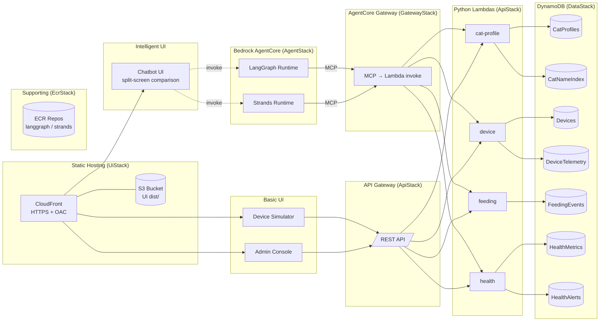
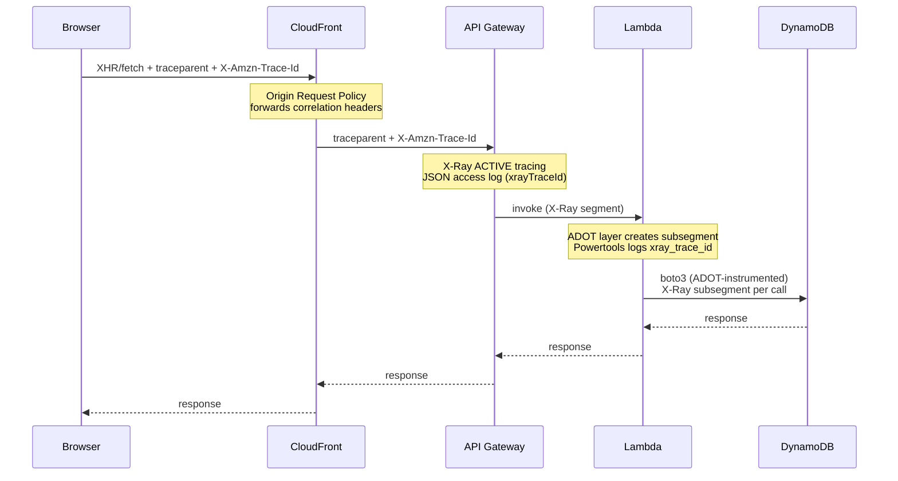
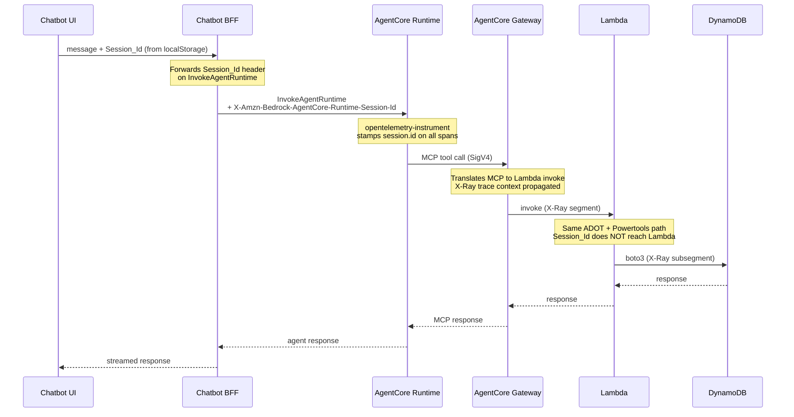
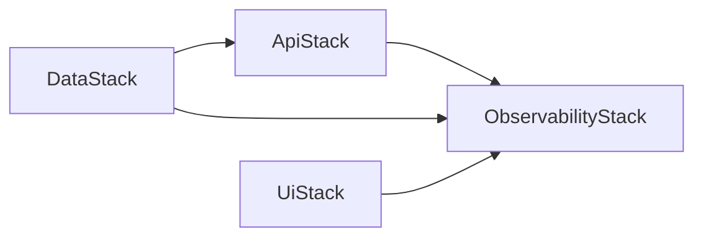

# Architecture

A serverless cat-care IoT demo built as a single CDK (TypeScript) app.
Every component is fully managed: API Gateway + Lambda, DynamoDB,
Bedrock AgentCore Runtime, and CloudFront + S3. No VPC, no EKS, no ECS,
no Cognito. All stacks deploy to `us-east-1`.

The whole point of the repo is to be *deliberately breakable* — bugs get
committed into Lambda or agent source on a `feature/*` branch, deployed
to the test account, and investigated with AIOps tooling. The design
below is optimized for clean failure surfaces, not production rigor.

## High-level diagram



## Stacks

The app is broken into eight CloudFormation stacks under `cdk/lib/`,
wired from `cdk/bin/app.ts`:

| Stack                | File                       | Purpose                                                       |
|----------------------|----------------------------|---------------------------------------------------------------|
| `DataStack`          | `data-stack.ts`            | All DynamoDB tables. No dependencies.                         |
| `ApiStack`           | `api-stack.ts`             | API Gateway + four Python Lambdas. Depends on DataStack.      |
| `EcrStack`           | `ecr-stack.ts`             | Named ECR repos (one per agent image, plus chatbot). No deps. |
| `AgentStack`         | `agent-stack.ts`           | AgentCore runtimes referencing tagged images in EcrStack repos. |
| `GatewayStack`       | `gateway-stack.ts`         | AgentCore Gateway (MCP) + 4 GatewayTargets pointing to Lambdas. |
| `FargateStack`       | `fargate-stack.ts`         | ECS Fargate + ALB hosting the Next.js chatbot BFF.            |
| `ObservabilityStack` | `observability-stack.ts`   | Application Signals discovery, three persona dashboards (SRE / GenAI / Business), four saved Logs Insights queries, SNS alarm topic + 23 alarms (Phase 4), Contributor Insights enabled on `DeviceTelemetry` + `HealthMetrics`. |
| `UiStack`            | `ui-stack.ts`              | CloudFront + S3 hosting the static UIs (device-sim, admin).   |
| `TrafgenStack`       | `trafgen-stack.ts`         | ECS Fargate scheduled task for the traffic generator + ADOT sidecar. Gated behind `-c trafgenEnabled=true`. |

Deployment order: `EcrStack` must exist before images are pushed, and
images must be pushed before `AgentStack` is deployed. CI handles this
as three phases (see **Deployment pipeline** below). DataStack and
UiStack are independent and can deploy alongside either phase.

## Data layer

Six DynamoDB tables, one per bounded context, all pay-per-request.
Single-table-per-domain (not single-table-design) is chosen so each
Lambda's IAM policy stays narrow and failure modes are easy to
attribute during investigation.

| Table             | Partition key      | Sort key       | GSI                         | Notes                     |
|-------------------|--------------------|----------------|-----------------------------|---------------------------|
| `CatProfiles`     | `cat_id`           | —              | —                           | Profile + metadata        |
| `Devices`         | `device_id`        | —              | `by-cat` on `cat_id`        | Device registry           |
| `DeviceTelemetry` | `device_id`        | `ts`           | —                           | Time-series + commands    |
| `FeedingEvents`   | `cat_id`           | `ts`           | —                           | Feeding history           |
| `HealthMetrics`   | `cat_id`           | `ts`           | —                           | Vitals time-series        |
| `HealthAlerts`    | `cat_id`           | `alert_id`     | —                           | Active health alerts      |

All tables use `RemovalPolicy.DESTROY` since the repo is demo-only.

## API layer

A single REST API Gateway with X-Ray tracing and CloudWatch metrics
enabled. Four Python 3.12 Lambdas handle the domain, and each holds
IAM permission only to the tables it touches.

| Endpoint                          | Method | Lambda         | Table(s) touched                  |
|-----------------------------------|--------|----------------|-----------------------------------|
| `/cats`                           | GET    | cat-profile    | CatProfiles (scan)                |
| `/cats`                           | POST   | cat-profile    | CatProfiles (put)                 |
| `/cats/{id}`                      | GET    | cat-profile    | CatProfiles (get)                 |
| `/devices`                        | GET    | device         | Devices (scan)                    |
| `/devices/{id}`                   | GET    | device         | Devices (get)                     |
| `/devices/{id}/commands`          | POST   | device         | DeviceTelemetry (put)             |
| `/devices/{id}/telemetry`         | POST   | device         | DeviceTelemetry (put)             |
| `/feedings?cat_id=…`              | GET    | feeding        | FeedingEvents (query)             |
| `/feedings`                       | POST   | feeding        | FeedingEvents (put), HealthAlerts (put on limit violation) |
| `/health/{cat_id}`                | GET    | health         | HealthMetrics (query)             |
| `/health/{cat_id}/alerts`         | GET    | health         | HealthAlerts (query)              |

Lambdas run with 256 MB / 10 s timeouts, Active X-Ray tracing, and
one-week log retention. Source lives under `cdk/lambda/<service>/`.

## Agent layer

Two independent Bedrock AgentCore runtimes, each backed by a Docker
image in its own named ECR repo created by `EcrStack`. Agents connect
to the data layer through AgentCore Gateway, which speaks the Model
Context Protocol (MCP). The gateway translates MCP tool calls into
Lambda invocations (or, locally, HTTP requests to the API shim).

In production, AgentCore Gateway is a managed AWS service that sits
between the agent runtimes and the Lambda functions — it translates
MCP tool calls directly into Lambda invocations (bypassing API Gateway).
For local development, a lightweight MCP Server (`mcp-server/server.py`)
fills the same role — it runs on the host at port 8083, accepts MCP
connections from agents via SSE transport, and forwards tool calls as
HTTP requests to the API shim on port 8000 (which wraps the same Lambda
handler code). This gives developers the same call topology locally that
they'll see in the cloud. The MCP Server is **not** deployed to AWS;
AgentCore Gateway replaces it entirely in production.

| Repo                           | Image source             |
|--------------------------------|--------------------------|
| `aiops-cat-demo-langgraph`     | `agents/langgraph/`      |
| `aiops-cat-demo-strands`       | `agents/strands/`        |

Lifecycle policy on each repo keeps the last 10 tagged images and
expires untagged images after 7 days. CI builds `linux/arm64` images on
the `ubuntu-24.04-arm` runner (Fargate ARM64 + AgentCore both run
ARM64), tags them with the commit SHA and `:latest`, and pushes them to
the matching repo between the first and second CDK deploy phases.
`AgentStack` and `FargateStack` read `-c imageTag=<sha>` to know which
tag to reference in their `AWS::BedrockAgentCore::Runtime` and Fargate
task-definition resources.

| Runtime      | Role                                                         |
|--------------|--------------------------------------------------------------|
| LangGraph    | ReAct agent using LangChain's `create_react_agent` with `ChatBedrockConverse`. |
| Strands      | Model-driven agent using the Strands SDK `Agent` class with `BedrockModel`.    |

Both agents use Claude Haiku 4.5 by default (`us.anthropic.claude-haiku-4-5-20251001-v1:0`),
configurable via the `MODEL_ID` environment variable. The `us.` cross-region
inference profile prefix is used so that requests route through the regional
inference endpoint. They share the same 9 API tools (cat
profiles, feedings, health, devices) and the same system prompt, but use
different frameworks — giving AIOps investigators two distinct failure
topologies to compare.

**Prompt management.** Both agents load their system prompt from a
`prompts.json` file via a shared `prompt_loader.py` module. This enables
prompt versioning and hot-reload without code changes.

Invocation flow (production):

```
Chatbot UI ──► AgentCore ──┬── LangGraph Runtime ──► AgentCore Gateway (MCP) ──► Lambda
                           └── Strands Runtime   ──► AgentCore Gateway (MCP) ──► Lambda
```

Invocation flow (local development):

```
Chatbot UI ──┬── LangGraph :8081 ──► MCP Server :8083 ──► API shim :8000 ──► DDB Local
             └── Strands :8082   ──► MCP Server :8083 ──► API shim :8000 ──► DDB Local
```

Each runtime is a FastAPI app exposing `/ping` (health) and
`/invocations` (the AgentCore contract). Agents connect to the MCP
Server via Streamable HTTP transport (`MCP_SERVER_URL` env var, default
`http://localhost:8083/mcp`) and load all 9 tools dynamically at
startup. Tool calls flow through the MCP Server to the REST API, so
injecting a bug in a Lambda shows up in both direct API traffic and
agent-mediated traffic — useful for comparing investigation approaches.

**Per-request MCP client construction.** Both runtimes build the MCP
client *and* the agent inside the request handler, not at module or
lifespan startup. Strands' `MCPClient.start()` snapshots `contextvars`
when its background thread spawns; constructing the client at import
time captures an empty OTel context, so every later tool call lands in
a fresh trace and orphans the Gateway spans from the agent span.
Building per-request makes the background thread inherit the runtime's
active server span, so traces stay connected end-to-end (matches the
AWS sample `sample-smart-home-assistant-agent-on-agentcore`). LangGraph
gets the same restructure, which also refreshes SigV4 credentials per
request — fixing a latent bug where lifespan-time auth would carry
expired credentials after ~1 h on long-running runtimes.

AgentCore is declared with `AWS::BedrockAgentCore::Runtime` via
`CfnResource` since a CDK L2 construct isn't available yet. The
runtime's execution role is granted `ecr:GetDownloadUrlForLayer` +
`ecr:BatchGetImage` on each repo via `Repository.grantPull`, plus
`bedrock:InvokeModel`, `bedrock:InvokeModelWithResponseStream`, and
`bedrock:CountTokens` on `*` (CountTokens is required by ADOT's
botocore patch to populate `gen_ai.usage.*` span attributes; without
it every model invocation trips an `AccessDeniedException` stack
trace and the GenAI dashboard's token panels stay empty).

## UI layer

A single S3 bucket (public access blocked, SSE-S3, HTTPS-only) fronted
by a CloudFront distribution with Origin Access Control. Three UI
bundles are deployed under their own prefixes:

| UI                | CloudFront path        | Description                                      |
|-------------------|------------------------|--------------------------------------------------|
| `chatbot`         | `/`                    | Split-screen comparison of LangGraph vs Strands  |
| `device-simulator`| `/device-simulator/*`  | Simulates IoT devices (telemetry + commands)     |
| `admin-console`   | `/admin-console/*`     | Cat management, feedings, health alerts          |

The Chatbot UI sends the same message to both agents in parallel and
displays responses side by side — left panel for LangGraph, right panel
for Strands — so differences in behavior are immediately visible.

SPA 403/404 responses are rewritten to `/index.html` so client-side
routing works. If `ui/<name>/dist` is missing on a fresh clone, the
stack substitutes a tiny placeholder page so `cdk synth` still succeeds.

No Cognito, no per-user auth. UIs are public but served only through
CloudFront over HTTPS; the S3 bucket itself stays fully locked down.

## Local development

Docker runs only DynamoDB Local and the API shim. The MCP Server and
agents run directly on the host so they inherit your shell's AWS
credentials and environment variables (no `~/.aws` mount needed).

```
Chatbot (Next.js, host)     :3000
Device Sim / Admin (Vite)   :5174 / :5175
       │
       │  HTTP
       ▼
langgraph agent (host)      :8081 ──┐
strands agent   (host)      :8082 ──┤
                                    │ MCP protocol (SSE)
                                    ▼
MCP Server      (host)      :8083
                                    │ HTTP (tool calls)
                                    ▼
local API shim  (docker)    :8000  (boto3 → DynamoDB Local)
                                    │
                                    ▼
DynamoDB Local  (docker)    :8001
```

Startup order: Docker (DDB + API) → MCP Server → Agents → UIs.

Bring up everything:

```bash
./local/scripts/up.sh              # DDB + API + MCP Server + agents + UIs
./local/scripts/up.sh --no-ui      # backend + agents only
./local/scripts/up.sh --no-agents  # DDB + API + MCP Server (start agents yourself)
./local/scripts/up.sh --no-mcp     # skip MCP Server (agents call API directly)
```

Override the model:

```bash
MODEL_ID=anthropic.claude-sonnet-4-20250514-v1:0 ./local/scripts/up.sh
```

## Traffic Generator

The `trafgen/` directory contains a Python CLI that produces realistic,
observable load against both the REST API and the agent stack. It runs
locally or in the cloud using the same codebase — only the `--target`
flag changes.

| Mode | Command | Auth | Output |
|------|---------|------|--------|
| Local | `trafgen run --target local --rps 1 --duration 5m` | none | `./runs/<run_id>.jsonl` |
| Cloud (laptop) | `trafgen run --target cloud --rps 0.5 --duration 30m` | SigV4 (boto3 chain) | `./runs/<run_id>.jsonl` + S3 |
| Cloud (Fargate) | Hourly EventBridge schedule | Task role | CloudWatch Logs + S3 |

The Fargate runner is deployed by `TrafgenStack` (`cdk/lib/trafgen-stack.ts`)
and gated behind `-c trafgenEnabled=true` so it doesn't affect existing
deploys. It uses a 512 CPU / 1024 MB ARM64 task definition with an ADOT
collector sidecar that receives OTel traces/metrics on `localhost:4317`
and exports them to X-Ray and CloudWatch. This makes trafgen appear in
the Application Signals Service Map alongside the agents and Lambdas.
The task runs for 55 minutes per hour and writes manifests to an S3
bucket with 7-day lifecycle.

Every dispatched call carries a W3C `traceparent` header so backend
telemetry (CloudWatch, Application Signals, X-Ray) can be filtered to
generator traffic. The run manifest (JSONL) records every call with its
traceparent, latency, status, and persona — enabling post-hoc correlation
between generator activity and observed failures.

See [`trafgen/README.md`](../trafgen/README.md) for install and usage,
and [`.kiro/specs/traffic-generator/design.md`](../.kiro/specs/traffic-generator/design.md)
for the full design.

## Feeding limits

The feeding Lambda (`cdk/lambda/feeding/handler.py`) enforces daily intake
rules to prevent overfeeding:

| Rule | Limit | Configurable via |
|------|-------|------------------|
| Daily total | 200g per cat per day | `DAILY_LIMIT_GRAMS` env var |
| Wet food daily | 100g per cat per day | hardcoded |
| Dry food daily | 150g per cat per day | hardcoded |
| Minimum interval | 2 hours between feedings | hardcoded |

Exceeding a limit returns HTTP 429 and creates a health alert
(`type: feeding_limit`) on the cat. A new EMF metric
`FeedingLimitViolations` fires on each violation.

## Evaluation framework

The `evaluation/` directory provides automated quality scoring for both
agents using an LLM-as-judge approach:

```
evaluation/
├── runner.py              # Sends prompts to both agents, records responses
├── judge.py               # LLM-as-judge: scores responses via Bedrock Claude
├── report.py              # Rich-formatted comparison tables
├── ci-run.sh              # Full local stack + eval + judge (CI or local)
├── datasets/
│   └── comparative.yaml   # 14 test cases across 6 categories
└── results/               # Output (gitignored)
```

**Scoring rules:**
- Each response is scored 0.0–1.0 against category-specific criteria
- Any single case below 0.7 → FAIL
- Average score below 0.75 → FAIL

**Categories tested:** efficiency, accuracy, error_recovery, ambiguity,
context (multi-turn), safety.

**CI integration:** The `agent-evaluation` job in `.github/workflows/pr-tests.yml`
runs on PRs touching `agents/`, `evaluation/`, or `mcp-server/`. It starts
the full local stack (DynamoDB Local + API + MCP Server + both agents),
runs all test cases, and gates the PR on the judge verdict. Requires AWS
OIDC credentials for Bedrock model access.

## Deployment pipeline

`main` is the source of truth. Two deployment pointer branches —
`test` and `release` — trigger GitHub Actions workflows that assume an
IAM role via OIDC and run `cdk deploy`. Everything lands in `us-east-1`.

```
feature/*  --force-push-->  test     --push-->  GHA (env: test)     --OIDC-->  cloudops-demo account
main       --fast-forward-> release  --push-->  GHA (env: release)  --OIDC-->  production account
```

Each workflow run executes three phases in order:

1. **Deploy non-agent stacks.** `cdk deploy ecr observability data api gateway`. This creates (or updates) the named ECR repos, the Application Signals discovery resource, DynamoDB tables, REST API + Lambdas, and AgentCore Gateway + targets. Note: `-c skipAgents=true` is *not* passed here — `app.ts` always synthesizes every stack so the cross-stack ECR exports stay stable. Phase 1 just names the stacks it wants to deploy.
2. **Build and push images.** `docker buildx build --platform linux/arm64 --push` for `agents/{langgraph,strands}` and `ui/chatbot`, tagged with the commit SHA (and `:latest`). Images land in the repos created in phase 1.
3. **Deploy agent + UI stacks.** `cdk deploy agents fargate ui -c imageTag=<sha>`. The stacks read the tag from CDK context and point `AWS::BedrockAgentCore::Runtime` and the Fargate task definition at the already-pushed images. Runtimes receive the Gateway URL via `MCP_SERVER_URL`.

A pre-flight `stack_health` job runs before phase 1: it queries CloudFormation for any `aiops-cat-demo-*` stack in a failed/rollback state and, if found, forces every phase to redeploy regardless of code diff. This fixes the case where a prior run left a stack in `UPDATE_ROLLBACK_COMPLETE` and the change-detection logic would otherwise skip recovery.

`cdk bootstrap` is expected to have been run once per account/region
already; CI does not re-bootstrap on every run.

Full branch rules, fast-forward rules, and teardown steps live in
[`CICD.md`](../CICD.md).

## Injecting failure

Bugs go in **source code** only — no env-var toggles. Two places to
edit, on a `feature/*` branch:

| Layer          | Path                            | Example bugs                                         |
|----------------|---------------------------------|------------------------------------------------------|
| Lambda         | `cdk/lambda/<service>/handler.py` | Latency sleep, null deref, wrong key, silent 500      |
| Agent          | `agents/<name>/server.py`       | Wrong route, infinite tool loop, bad prompt, mis-parse |

Commit message should describe the bug honestly — this repo exists so
the user can *find* those bugs, not hide them.

After committing to `feature/xyz`:

```
git push --force-with-lease origin feature/xyz:test
```

GitHub Actions deploys that exact commit to the test account, and
investigation happens against the live stack (CloudWatch Logs,
X-Ray traces, agent invocation logs, CloudFront access logs).

## Observability layer

The observability layer makes every injected bug surface as a CloudWatch
signal without manual log grepping. It spans four concerns:
auto-instrumentation on compute, header propagation for trace stitching,
a dedicated `Observability_Stack` for account-scoped resources, and
business signals on top of the golden metrics.

### Observability Stack (`aiops-cat-demo-observability`)

A dedicated CDK stack (`cdk/lib/observability-stack.ts`) owns all
account-scoped observability resources. It depends on `ApiStack`,
`DataStack`, and `UiStack` so it can reference Lambda functions, DynamoDB
tables, and the CloudFront distribution.

What it creates:

| Resource type | Count | Purpose |
|---------------|-------|---------|
| `CfnDiscovery` (Application Signals) | 1 | Enables the Service Map for the account+region |
| CloudWatch Dashboards | 3 | SRE, GenAI, Business persona views |
| `QueryDefinition` (Logs Insights) | 4 | Saved queries for trace errors, slow tools, DDB throttles, injected markers |
| SNS Topic + email subscription | 1 | Alarm delivery to `config.alarmEmail` |
| CloudWatch Alarms | 23 | Anomaly detectors + static thresholds (see below) |
| `CfnInvestigationGroup` (opt-in) | 0-1 | Persistent investigation group when `-c investigationsGa=true` |

### Application Signals — auto-instrumentation

Every compute layer is auto-instrumented. No hand-rolled tracing code.

**Lambda (ADOT layer + Powertools):**

- Each Lambda gets the region-matched AWS Distro for OpenTelemetry Python
  layer with `AWS_LAMBDA_EXEC_WRAPPER=/opt/otel-instrument`.
- The managed policy `CloudWatchLambdaApplicationSignalsExecutionRolePolicy`
  is attached to every Lambda execution role.
- Handlers use Powertools `Logger` (auto-stamps `xray_trace_id`,
  `function_request_id`, `cold_start`) and `Metrics` (namespace `CatDemo`,
  dimensioned by `service`). No Powertools `tracer` extra — ADOT owns tracing.
- Per-service EMF metrics: `CatProfilesRead/Written`, `DevicesCommanded/DeviceWriteSuccess`,
  `FeedingsRead/Created`, `HealthMetricsRead/HealthAlertsRead`.

**API Gateway (access logs):**

- JSON access logs to `/aws/apigateway/cat-demo-access` (7-day retention)
  with fields: `requestId`, `extendedRequestId`, `status`, `resourcePath`,
  `httpMethod`, `responseLatency`, `integrationStatus`, `integrationLatency`,
  `requestTime`, `sourceIp`, `userAgent`, `xrayTraceId`.
- `tracingEnabled: true` and `metricsEnabled: true` on the stage.

**AgentCore Runtimes (`opentelemetry-instrument`):**

- Both LangGraph and Strands Dockerfiles use
  `CMD ["opentelemetry-instrument", "uvicorn", "server:app", ...]` as the
  entrypoint. ADOT auto-instrument owns the `TracerProvider`.
- Dependencies: `aws-opentelemetry-distro>=0.10.0` on both;
  `opentelemetry-instrumentation-langchain` on LangGraph;
  `strands-agents[otel]` on Strands.
- A `tracing_extras.py` module attaches an auxiliary `CodeMetadataSpanProcessor`
  to the existing `TracerProvider` (stamps `code.filepath`, `code.lineno`,
  `code.function` on spans) without creating a new provider.
- The AgentCore execution role grants `cloudwatch:PutMetricData`,
  `logs:DescribeLogStreams`, `logs:DescribeLogGroups` for metric emission.

### CloudWatch Dashboards

Three persona-scoped dashboards:

**SRE Dashboard (`aiops-cat-demo-sre`):**
- Alarm status widget (all 23 alarms)
- API Gateway 4xx/5xx per resource path
- Per-Lambda Duration (p50, p90, p99), Errors, Throttles
- Per-table DynamoDB ConsumedRead/WriteCapacityUnits, ThrottledRequests
- Contributor Insights widgets for DeviceTelemetry and HealthMetrics top partitions

**GenAI Dashboard (`aiops-cat-demo-genai`):**
- Markdown link to the CloudWatch GenAI Observability console
- Per-runtime InvocationLatency (p50, p90, p99) from `bedrock-agentcore` namespace
- Per-runtime token usage over time (InputTokens, OutputTokens)
- LangGraph vs Strands latency p95 comparison (single chart, two series)
- LogQueryWidget: slowest 10 tool calls in the last hour
- AgentCore Gateway target invocation error count by target

**Business Dashboard (`aiops-cat-demo-business`):**
- `FeedingsCreated` rate per minute
- `HealthAlertsRead` count per hour
- `DevicesCommanded` count per minute
- Per-service breakdown of each KPI

### Alarms

All 23 alarms publish to the SNS topic `aiops-cat-demo-alarms`:

| # | Count | Alarm | Source |
|---|-------|-------|--------|
| 6.1 | 4 | Lambda Duration p99 anomaly band (wide 4-stddev band, 5-min period, 3 datapoints) | per `FunctionName` |
| 6.2 | 4 | Lambda Errors > 0 | per `FunctionName` |
| 6.3 | 1 | API GW 5XXError anomaly band | aggregate |
| 6.4 | 7 | DDB ThrottledRequests > 0 | per `TableName` |
| 6.5 | 1 | Bedrock ThrottlingException > 0 | account-wide |
| 6.6 | 1 | `DeviceWriteSuccess` BELOW anomaly band | catches silent DDB swallows |
| 6.7 | 2 | Per-runtime token anomaly band | catches agent loops |
| 6.8 | 1 | Gateway target invocation errors > 0 | misconfigured targets |
| 6.9 | 1 | RUM JS error rate anomaly band | browser-side errors |
| 6.10 | 1 | CloudFront 5xxErrorRate > 1% | aggregate distribution |

Anomaly-band alarms need ~14 days of history to learn a useful boundary;
expect them to sit in `INSUFFICIENT_DATA` until then. Static threshold
alarms fire immediately.

### Contributor Insights

Enabled on two DynamoDB tables for hot-partition and full-scan detection:

- **DeviceTelemetry** — surfaces the top accessed/throttled partition keys
  during a hot-partition bug scenario.
- **HealthMetrics** — surfaces the top accessed partition keys during a
  full-table-scan regression.

### SNS topic for alarm notifications

A single topic (`aiops-cat-demo-alarms`) with one email subscription
(`config.alarmEmail`). The topic policy restricts `sns:Publish` to
`cloudwatch.amazonaws.com` with an `aws:SourceArn` condition scoped to
alarms in the deployment account.

### Trace flow — REST API path

How traces flow from the browser through CloudFront, API Gateway, Lambda,
to DynamoDB (with X-Ray segments at each hop):



Each hop produces an X-Ray segment/subsegment. The `xrayTraceId` field
in API Gateway access logs joins with the `xray_trace_id` field in
Lambda structured logs, enabling cross-layer correlation in Logs Insights.

### Trace flow — Agent path

How agent traces flow from the Chatbot BFF through AgentCore to Lambda:



Session_Id stays in the agent tier (Runtime + Gateway). Lambda sees only
the X-Ray trace context. Investigators start from the GenAI Observability
session view, then drill into downstream Lambda/DynamoDB spans via the
shared X-Ray trace ID.

### Stack dependency diagram



`ObservabilityStack` is created last so it can reference Lambda functions,
DynamoDB tables, and the CloudFront distribution from the other stacks.

### Saved Logs Insights queries

Four `QueryDefinition` resources under the prefix `aiops-cat-demo/`:

| Query | Target log groups | Purpose |
|-------|-------------------|---------|
| `A-all-errors-for-trace` | All 4 Lambda log groups | Filter by `xray_trace_id` to find all errors for a specific trace |
| `B-slowest-tool-calls` | Both AgentCore Runtime log groups | Rank tool calls by duration in the last hour |
| `C-ddb-throttles-by-table` | All 4 Lambda log groups | Group DynamoDB throttle exceptions by table name |
| `D-injected-bug-marker` | All Lambda + Runtime log groups | Find any log line containing `INJECTED` |

### Signal inventory (quick reference)

| Signal                       | Where                                                                |
|------------------------------|----------------------------------------------------------------------|
| Lambda logs                  | `/aws/lambda/<function-name>` (1-week retention), JSON-structured via Powertools `Logger` (auto-stamps `xray_trace_id`, `function_request_id`, `cold_start`). |
| Lambda + API X-Ray           | Active tracing on every Lambda and the API Gateway stage.            |
| Lambda Application Signals   | Each Lambda is wrapped with the AWSOpenTelemetryDistroPython layer (`AWS_LAMBDA_EXEC_WRAPPER=/opt/otel-instrument`) and the `CloudWatchLambdaApplicationSignalsExecutionRolePolicy` managed policy. Region→layer-ARN table lives in `cdk/lib/observability.ts`. |
| Lambda business metrics (EMF)| Each handler emits per-service Powertools `Metrics` to stdout — e.g. `cat-profile` → `CatProfilesRead/Written`, `device` → `DevicesCommanded/DeviceWriteSuccess`, `feeding` → `FeedingsRead/Created`, `health` → `HealthMetricsRead/HealthAlertsRead`. `DeviceWriteSuccess` only fires after `put_item` confirms — silent-swallow bugs drop the metric below band. |
| API Gateway access logs      | Line-delimited JSON to `/aws/apigateway/cat-demo-access` (7-day retention) with the fields needed for Logs Insights joins on `xrayTraceId` / `requestId`. |
| API Gateway metrics          | CloudWatch, including per-method latency / 4xx / 5xx.                |
| Application Signals discovery| `ObservabilityStack` owns a single account/region `CfnDiscovery` so the Service Map populates. Required exactly once per account+region. |
| AgentCore runtime logs       | CloudWatch (auto-provisioned by the service).                        |
| AgentCore Runtime traces     | X-Ray via CloudWatch Logs delivery (TRACES → XRAY) wired in `AgentStack`. Without this, AgentCore accepts the inbound `traceparent` but never publishes its own data-plane segment, so caller spans (chatbot/trafgen) and the runtime container's server span land in the same `trace_id` as two disconnected branches in the Service Map. Requires Transaction Search enabled. |
| AgentCore Gateway traces     | X-Ray via CloudWatch Logs delivery (TRACES → XRAY); requires Transaction Search enabled (one-time per account, see CICD.md). |
| GenAI usage attributes       | ADOT's botocore patch calls `bedrock:CountTokens` around `InvokeModel`/`Converse` to populate `gen_ai.usage.input_tokens`/`output_tokens` on agent spans. The AgentCore execution role grants `bedrock:CountTokens`; the foundation-model id is used (not the cross-region `us.` inference profile) because CountTokens rejects inference-profile ids. |
| CloudFront access logs       | Off by default — enable per investigation if needed.                 |
| DynamoDB metrics             | Standard CloudWatch metrics on each table.                           |
| Persona dashboards           | `ObservabilityStack` provisions three CloudWatch dashboards: `aiops-cat-demo-sre` (API GW 4xx/5xx, per-Lambda Duration/Errors/Throttles, per-table consumed/throttled capacity, plus an `AlarmStatusWidget` populated by Phase 4), `aiops-cat-demo-genai` (per-runtime `bedrock-agentcore` latency + token usage, p95 LangGraph vs Strands, slowest tool calls Logs Insights widget, Gateway target errors), and `aiops-cat-demo-business` (`CatDemo.FeedingsCreated`, `HealthAlertsRead`, `DevicesCommanded` KPIs plus per-service breakdown). |
| Saved Logs Insights queries  | Four `QueryDefinition`s under the prefix `aiops-cat-demo/`: `A-all-errors-for-trace` (filter by `${trace_id}`), `B-slowest-tool-calls`, `C-ddb-throttles-by-table`, `D-injected-bug-marker`. |

## What this repo deliberately does *not* include

- VPC, NAT, Transit Gateway — not needed for a fully serverless demo.
- Cognito / per-user auth — scope creep for a breakability test-bed.
- EKS / ECS / EC2 — the reference design had those; this variant keeps only serverless.
- PostgreSQL / RDS — all state lives in DynamoDB.
- Environment-variable failure toggles — bugs are source-level, period.
- Production hardening (WAF, custom domain, monitoring alarms beyond defaults).
