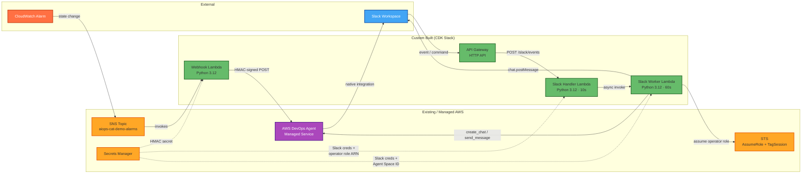
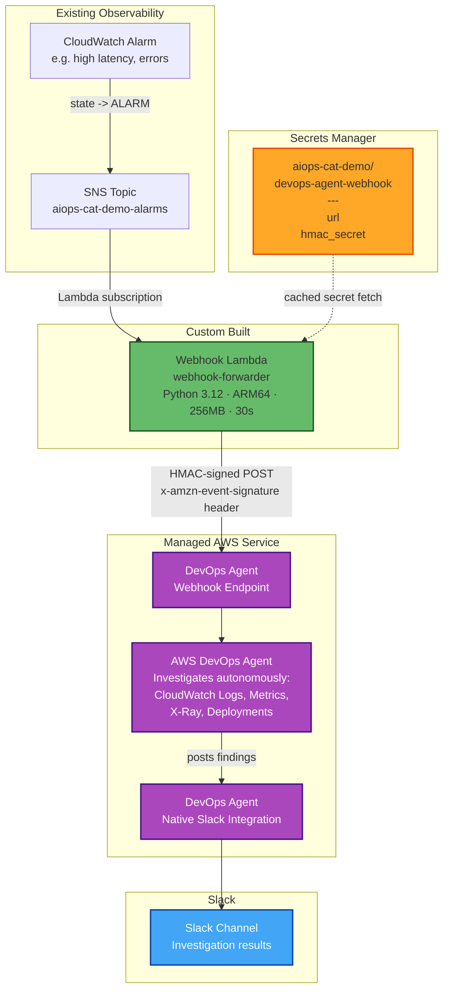
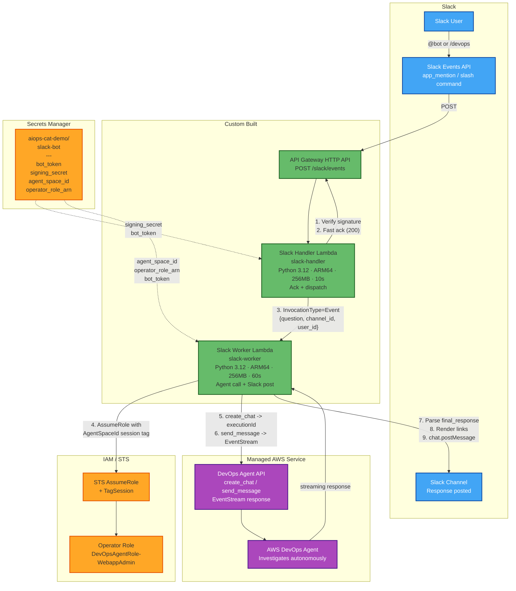
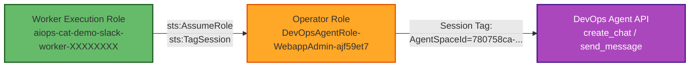

# Architecture: Slack Integration for AIOps Cat Demo

This document describes the architecture for integrating the AIOps Cat Demo with AWS DevOps Agent via two complementary paths: automated alarm investigation and interactive Slack Q&A.

---

## Combined Overview

Both paths converge on the managed AWS DevOps Agent service. Custom-built components (Lambdas, API Gateway, CDK stack) are minimal glue code — all investigation intelligence lives inside DevOps Agent.



**Legend:**
| Color | Hex | Meaning |
|-------|-----|---------|
| Green (`#66bb6a`) | fill | Custom-built components (deployed via CDK) |
| Purple (`#ab47bc`) | fill | AWS DevOps Agent (managed service) |
| Orange (`#ffa726`) | fill | Shared AWS infrastructure (SNS, Secrets Manager, STS) |
| Blue (`#42a5f5`) | fill | Slack (external) |
| Red-orange (`#ff7043`) | fill | CloudWatch (existing observability) |

---

## Path A: Automated Alarm Investigation

When a CloudWatch Alarm fires, the system automatically triggers a DevOps Agent investigation. Results are pushed to Slack via DevOps Agent's native Slack integration — no custom code needed for the response path.



**Flow:**
1. CloudWatch Alarm transitions to `ALARM` state
2. SNS topic `aiops-cat-demo-alarms` receives the state change notification
3. SNS invokes the Webhook Lambda (subscription)
4. Lambda retrieves HMAC secret from Secrets Manager (cached after first call)
5. Lambda constructs webhook payload with alarm metadata (name, state, reason, timestamp)
6. Lambda computes `base64(HMAC-SHA256(secret, "{timestamp}:{body}"))` and POSTs to the DevOps Agent webhook
7. DevOps Agent autonomously investigates (queries logs, metrics, traces, deployments)
8. DevOps Agent pushes investigation results to Slack via its native integration

**Signing contract:**
- Header `x-amzn-event-signature`: base64-encoded HMAC-SHA256 (no `sha256=` prefix)
- Header `x-amzn-event-timestamp`: ISO-8601 timestamp (same value used in the signed input)
- Body: compact JSON (`separators=(",", ":")`)
- `incidentId` must be unique per request (alarm name + epoch nanoseconds)

**Error handling:** Non-2xx responses from DevOps Agent trigger an exception, which causes SNS to retry delivery (up to 3 attempts with backoff).

---

## Path B: Interactive Slack Q&A (Two-Lambda Async Pattern)

Developers ask questions directly in Slack. The system uses two Lambdas to stay within Slack's 3-second acknowledgement deadline while the DevOps Agent interaction takes ~18s.



**Flow:**
1. User mentions the bot (`@devops-agent`) or uses the `/devops` slash command
2. Slack sends event to API Gateway endpoint (`POST /slack/events`)
3. **Slack Handler Lambda** (ack phase, <3s):
   - Verifies the request signature (HMAC-SHA256 with Slack Signing Secret)
   - Rejects timestamps older than 5 minutes (replay protection)
   - Ignores bot messages (infinite loop prevention)
   - Handles `url_verification` challenges synchronously
   - Extracts user question (strips bot mention, truncates to 4000 chars)
   - Async-invokes the Worker Lambda (`InvocationType='Event'`)
   - Returns HTTP 200 immediately (Slack is satisfied)
4. **Slack Worker Lambda** (async phase, up to 60s):
   - Assumes the DevOps Agent operator role via STS with a mandatory `AgentSpaceId` session tag
   - Creates a `devops-agent` boto3 client with the assumed credentials
   - Calls `create_chat(agentSpaceId=...)` to get an `executionId`
   - Calls `send_message(...)` which returns a streaming EventStream
   - Parses the stream: prefers the `final_response` content block over streamed `text` blocks
   - Renders `[[investigation:id:title]]` markers as Slack `<url|label>` deep links
   - Posts the answer to Slack via `chat.postMessage` (truncated to 4000 chars)

**Why two Lambdas?**
Slack requires a 200 response within 3 seconds or it retries the event delivery (causing duplicates). The DevOps Agent round-trip takes ~18.7s. Splitting into ack + async worker avoids timeout and retry issues entirely.

**Security:**
- All requests verified via Slack signature (`v0=` prefixed HMAC-SHA256 hex)
- Requests with timestamps older than 5 minutes are rejected (replay attack prevention)
- Bot messages are ignored to prevent infinite loops
- Worker role is fixed-name (suffixed with a deployment ID from SSM) so the operator role trust policy can be scoped precisely
- Operator role trust uses `aws:PrincipalArn` condition (not direct role principal) to allow trust policy to be set before the role exists

**Error handling:** If the DevOps Agent call fails, the Worker Lambda posts a user-friendly error message to the originating Slack channel.

---

## IAM Trust Chain (Path B)

The Worker Lambda needs to call the DevOps Agent API, which requires assuming a managed operator role with a session tag. This is the trust chain:



The operator role's trust policy allows the worker role via:
```json
{
  "Sid": "SlackWorkerXXXXXXXX",
  "Effect": "Allow",
  "Principal": {"AWS": "arn:aws:iam::719821274597:root"},
  "Action": ["sts:AssumeRole", "sts:TagSession"],
  "Condition": {"ArnLike": {"aws:PrincipalArn": "arn:aws:iam::719821274597:role/aiops-cat-demo-slack-worker-XXXXXXXX"}}
}
```

The `XXXXXXXX` suffix is a random deployment ID stored in SSM (`/aiops-cat-demo/slack/deployment-id`) and passed to CDK via `-c slackDeploymentId=...`.

---

## Infrastructure Summary

| Component | Type | Timeout | Managed By |
|-----------|------|---------|------------|
| CloudWatch Alarms | Monitoring | — | Existing (observability stack) |
| SNS Topic `aiops-cat-demo-alarms` | Messaging | — | Existing (observability stack) |
| Webhook Forwarder Lambda | Compute | 30s | Custom (CDK stack) |
| Slack Handler Lambda | Compute | 10s | Custom (CDK stack) |
| Slack Worker Lambda | Compute | 60s | Custom (CDK stack) |
| API Gateway HTTP API | Networking | — | Custom (CDK stack) |
| Secrets Manager (2 secrets) | Security | — | Pre-provisioned (manual) |
| SSM Parameter Store | Config | — | Created by `ensure-deployment-id.sh` |
| AWS DevOps Agent | AI Service | — | Managed AWS service |
| DevOps Agent Slack Integration | Notifications | — | Managed (DevOps Agent native) |
| Slack App (bot) | External | — | Slack marketplace |

---

## Secrets

| Secret Name | Keys | Used By |
|-------------|------|---------|
| `aiops-cat-demo/devops-agent-webhook` | `url`, `hmac_secret` | Webhook Forwarder Lambda |
| `aiops-cat-demo/slack-bot` | `bot_token`, `signing_secret`, `agent_space_id`, `operator_role_arn`, `app_token` | Slack Handler + Worker Lambdas |

Both secrets are pre-provisioned manually. The CDK stack references them by ARN but never creates or modifies them.

---

## Deployment

All custom components are defined in a single CDK stack, gated behind a context flag:

```bash
# Prerequisites
DEPLOY_ID=$(slack/scripts/ensure-deployment-id.sh --profile cloudops-demo)
slack/scripts/update-operator-trust.sh \
  --operator-role-arn arn:aws:iam::719821274597:role/service-role/DevOpsAgentRole-WebappAdmin-ajf59et7 \
  --deployment-id "$DEPLOY_ID" \
  --profile cloudops-demo

# Deploy
cd cdk
AWS_PROFILE=cloudops-demo npx cdk deploy aiops-cat-demo-slack \
  -c slackEnabled=true \
  -c slackDeploymentId="$DEPLOY_ID"
```

**Post-deploy:** Set the API Gateway endpoint (from stack output `SlackApiEndpoint`) as the Slack App's Request URL for Events and Slash Commands.

---

## File Layout

```
slack/
  cdk/lib/slack-stack.ts          CDK stack definition
  cdk/test/slack-stack.test.ts    CDK unit tests (jest)
  lambda/webhook-forwarder/       Path A: SNS -> DevOps Agent webhook
    handler.py
  lambda/slack-handler/           Path B ack: verify + fast-ack + dispatch
    handler.py
  lambda/slack-worker/            Path B async: agent call + Slack post
    handler.py
    requirements.txt              boto3>=1.43 (devops-agent client)
  scripts/
    ensure-deployment-id.sh       Idempotent SSM parameter for role suffix
    update-operator-trust.sh      Add worker role to operator trust policy
  tests/                          Unit + live integration tests
  docs/
    architecture.md               This file
    setup-guide.md                Step-by-step provisioning guide
```
